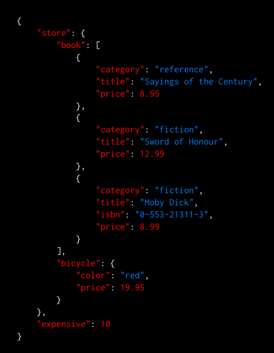

slidenumbers: true

# How do you like PostgreSQL12

## 2020-01-25 <br> 第28回 中国地方DB勉強会 in 岡山

#### 日本PostgreSQLユーザー会 中国地方支部長 <br> 高橋　一騎

---

# 注意事項

- スライドは公開しています。
- 質問とかあれば、セッション中に遠慮なく聞いてください！
- 聞くのはちょっと・・って人がいれば #ChugokuDB へお願い致します！

---

# おしながき

1. 自己紹介
2. PostgreSQLとは
3. PostgreSQL12の新機能
4. PostgreSQL13に期待される機能

---

# 1. 自己紹介

- 高橋　一騎
- 岡山在住
- 株式会社オミカレ
Webアプリケーションエンジニア
- 日本PostgreSQLユーザー会
中国支部長


---

# 株式会社オミカレ

- 全国の婚活パーティー
約30,000件を掲載してる
ポータルサイト.
- 出会いが0をZeroにする
をVisionに日々活動してます
- エンジニア（インフラの人）を
募集してます！


---

# 2. PostgreSQLとは

---

# 2. PostgreSQLとは

- `PostgreSQL（ぽすとぐれすきゅーえる）`

代表的なオープンソースのRDBMSの1つ
元々、大学の研究用に開発された研究用のRDBMSの
Ingresが元となっている。
研究用に利用されていた事もあり、
理論に忠実に開発されている。

---

# 2. PostgreSQLとは

- SQL標準に準拠した構文のサポート
- 複数種類のIndex種別のサポート
- 豊富なデータ型のサポート

---

## SQL標準に準拠した構文のサポート

- SQL標準
メーカーやシステムによって仕様が大きく異なってた。
標準化を求める声が多く集まった。
- ISO/IEC 9075 として国際標準化された。
- Check制約とかWindow関数とか。
（8.0までMySQLにはなかったんや・・）

---

## 複数種類のIndex種別のサポート

- B-Tree Index
- Hash Index
- GiST Index, SP-GiST Index , GIN Index (全文検索)
- BRIN Index

---

## 豊富なデータ型のサポート

- 列列挙（Enum）
- 幾何データ型
  - 座標点、直線、円
- IPアドレス型 (IPv4, IPv6)
  - 192.168.10.5, 192.168.11.1 どっちが大きいか比較出来る.
- JSON型 / 配列型 / 範囲型

---

# バージョンアップ履歴

- 約1年サイクルでメジャーバージョンアップが行われている。
- 9.6 までは x.y.z というバージョン形式だった
  - x.y : メジャーバージョン
  - z   : マイナーバージョン
- 10より x.z というバージョン形式になった。
  - x : メジャーバージョン
  - z : マイナーバージョン

---

# [fit]という所で・・・ <br>PostgreSQL12 今日のお話です！！！

---

# 3. PostgreSQL12の新機能

---

# 3. PostgreSQL12の新機能

- 生成列のサポート
- JSON PATH のサポート
- pg_dumpの強化
- テーブル・パーティショニングが更に強化
- Access Method

---

# 生成列(GENERATED列)のサポート

---

# 生成列のサポート

- 生成列は、テーブルに対して計算結果を元にした列を定義する.

```sql
CREATE TABLE member
(
 id SERIAL NOT NULL CONSTRAINT member_pkey PRIMARY KEY,
 first_name VARCHAR(50) NOT NULL,
 last_name VARCHAR(50) NOT NULL,
 full_name VARCHAR(50) NOT NULL GENERATED ALWAYS AS ( first_name || ' ' || last_name) STORED
);
```

- `full_name`は `first_name` と `空白` と `last_name` を
文字列結合したものになる。

---

# 生成列

実際に動かしてみるとこんな感じ

```sql
chugokudb=# INSERT INTO member (first_name, last_name) VALUES ('高橋', '一騎');
INSERT 0 1
chugokudb=#
chugokudb=# SELECT * FROM member;
 id | first_name | last_name | full_name 
----+------------+-----------+-----------
  1 | 高橋       | 一騎      | 高橋 一騎
(1 row)

```

---

# 生成列

- Insertは不可.

```sql
chugokudb=# INSERT INTO member (first_name, last_name, full_name) 
chugokudb-# VALUES ('高橋', '一騎', '高橋 一騎');
ERROR:  cannot insert into column "full_name"
DETAIL:  Column "full_name" is a generated column.
```

- DB2 => 値を渡せばその値、
 渡さなかったら生成列 みたいな奴もある.

---

# [fit] 「お、やった！ これで誕生日から年齢を常に計算出来るやん！」

---
[.autoscale: true]

# 生成列

**生成列の制約**

- 不変な値を返す関数しか使えない
- その他の生成列の値を参照する事は出来ない
- 生成列はパーティションキーに指定する事は出来ない
- など

... age(timestamp) はimmutableな関数じゃない.
（そもそも、INSERT時に値を生成して実体としてデータを保持する仕組み.）

---

## つまり、ずっと ハタチ

---

[.autoscale: true]
# 生成列

- 書き換わるタイミングは INSERT/UPDATE の時。
- ちなみに豆知識として...
SELECTの度に計算してくれる仕組みも他のRDBMSにある
  - `仮想列` と呼ばれる
  - `GENERATED ALWAYS AS ( ) STORED` を
   `GENERATED ALWAYS AS ( ) VIRTUAL` と書けば仮想列（他RDBMSの場合）
  - 構文も似てるのでいつかは実装されそう（願望

---

# 生成列のサポート

**何が嬉しいか**
- データとしては 苗字、名前 は分けて持ちたいけど
 参照としては 苗字+名前で使いたい。
- MySQLで 疑似Check制約として使うTipsがあった。

```sql
CREATE TABLE users
(
 id SERIAL NOT NULL CONSTRAINT users_pkey PRIMARY KEY,
 gender integer NOT NULL,
 gender_text NOT NULL VARCHAR(2) GENERATED ALWAYS AS
  (CASE WHEN (gender = 0) then '男性' WHEN (gender = 1) then '女性' ELSE NULL END) STORED
);
```

---

# JSON PATH のサポート

---

# JSON PATH のサポート

PostgreSQLでは2012年のv9.2からJSON型をサポート
各バージョン毎にJSON型へのサポートを強化していった

- 今回はSQL2016標準で提唱された
SQL/JSONに関する一部の関数を提供
- 検索をより楽に.

---

# PostgreSQLとJSONの歩み

- PostgreSQLではv9.2（2012年）からJSON型をサポート
- v9.4（2014年）ではJSONB型をサポート 
GINインデックスもサポート開始
- v9.3、v9.5...v11では関数や演算子の強化
例えば JSON型をパースしてレコードに変換する関数とか

^ MySQLでは 2015年 5.7.8 から

---

# JSON型とJSONB型の違い

| | JSON型 | JSONB型 |
| --- | --- | --- |
| 格納方式 | テキスト | バイナリ（不要な空白や重複keyを削除など）| 
| インデックス | Btree | Btree, GINインデックス | 
| 検索性能 | 一般的に低速、評価の度に内部でパーサーが動く | GINにより効率的に検索可能 | 

---

- JSON型とJSONB型の違い

**JSON型**

```sql
CREATE TABLE member
(
 id SERIAL NOT NULL CONSTRAINT member_pkey PRIMARY KEY,
 profile JSON NOT NULL
);
```

**JSONB型**

```sql
CREATE TABLE member
(
 id SERIAL NOT NULL CONSTRAINT member_pkey PRIMARY KEY,
 profile JSONB NOT NULL
);
```

---

- JSON型とJSONB型の違い (INSERT/SELECT *)

```sql
INSERT INTO member (profile) VALUES ('{"name": "高橋", "gender": "男性", "age":"29"}');
```

**JSON型**

```
 id |                    profile                     
----+------------------------------------------------
  1 | {"name": "高橋", "gender": "男性", "age":"29"}
(1 row)
```

**JSONB型**

```
 id |                     profile                     
----+-------------------------------------------------
  1 | {"age": "29", "name": "高橋", "gender": "男性"}
(1 row)
```

---

[.autoscale: true]
- JSON型とJSONB型の違い (WHERE)

```sql
EXPLAIN ANALYZE SELECT * FROM member WHERE profile->>'name' = '高橋';
```

**JSON型**

**JSONB型**

- どちらも同じレコードが返る.


---

[.autoscale: true]
- JSON型とJSONB型の違い (WHERE)

**JSON型**

```sql
SELECT * FROM member WHERE profile = '{"name": "高橋", "gender": "男性", "age":"29"}'::json;

ERROR:  operator does not exist: json = json
```

**JSONB型**

```sql
SELECT * FROM member WHERE profile = '{"name": "高橋", "gender": "男性", "age":"29"}'::jsonb;

 id |                     profile                     
----+-------------------------------------------------
  1 | {"age": "29", "name": "高橋", "gender": "男性"}
```

等価比較だけじゃなくて `含む` とかも検索出来る

---

- JSONB型演算子

```sql
# 結合
・ SELECT profile || '{"birthday":"1990-12-11"}'::jsonb FROM member;
  # {"age": "29", "name": "高橋", "gender": "男性", "birthday": "1990-12-11"}

# 削除
・ SELECT profile - 'name'::jsonb FROM member;
  # {"age": "29", "gender": "男性"}

# keyチェック OR
・ SELECT id, profile ?| array['name','birthday'] FROM member_b;
  # true

# keyチェック AND
・ SELECT profile ?| array['name','birthday'] FROM member;
  # false
```

---

### JSON型とJSONB型の違い

JSON型とJSONB型、JSONB型の方が良い。
- 関数のサポートが豊富
（更新や展開が楽）
- インデックスによる検索にも対応しており高速

---

# JSON PATHのサポート

- JSONB型への機能の追加
- 値の取り出しを楽にする機構

---

# JSON PATHの例

| JSON PATH | 説明 |
| --- | --- |
|`$.store.book[*].title` | bookの中のtitleを取得 |
|`$..price` | 全エレメントの中からpriceを再帰的に取得 |
|`$..book[2]` | bookを再帰的に取得した後bookの配列の3番目を取得 |
|`$..book.length()` | bookを再帰的に取得した後bookの配列の要素数を取得 |



---

# JSON PATH の例

- `jsonb_path_query`: `指定されたJSONB値のJSONPATHによって返されたすべてのJSON項目を取得`

- `jsonb_path_exists`: `JSONPATHが指定されたJSONB値の項目を返すかどうかを確認する`

```sql
CREATE TABLE books
(
 id SERIAL NOT NULL CONSTRAINT books_pkey PRIMARY KEY,
 data JSONB NOT NULL
);
```

---

# デモ

^ INSERT INTO books(data) VALUES ('{"store":{"book":[{"category":"reference","author":"Nigel Rees","title":"Sayings of the Century","price":8.95},{"category":"fiction","author":"Evelyn Waugh","title":"Sword of Honour","price":12.99},{"category":"fiction","author":"Herman Melville","title":"Moby Dick","isbn":"0-553-21311-3","price":8.99},{"category":"fiction","author":"J. R. R. Tolkien","title":"The Lord of the Rings","isbn":"0-395-19395-8","price":22.99}],"bicycle":{"color":"red","price":19.95}},"expensive":10}')

---

# JSON PATHのサポート

- JSON PATH によって再帰的に検索が行われるので楽.
- 曽根先生の名著『失敗から学ぶRDBの正しい歩き方』にもあるように【JSONの甘い罠】に注意.
（こうやってちやほやするのも後一週間ですね☆）
- ORM...

---

# pg_dumpの強化

---

# pg_dumpの強化

（ここらで少し楽なもの）

pg_dump に以下のオプションが追加

- `--rows-per-insert`
- `--on-conflict-do-nothing`

上記はどちらも `--inserts` オプションと同様に使用する

---

# pg_dumpの強化

```sql
CREATE TABLE option_user
(
 id SERIAL NOT NULL PRIMARY KEY,
 name VARCHAR(50) NOT NULL
);
```

---

[.autoscale: true]

# pg_dumpの強化

- `pg_dump -U docker -t option_user chugokudb --inserts`

```sql
INSERT INTO public.option_user VALUES (1, 'Berte Kliement');
INSERT INTO public.option_user VALUES (2, 'Lula Da Costa');
INSERT INTO public.option_user VALUES (3, 'Rodi Rapport');
INSERT INTO public.option_user VALUES (4, 'Iris Runacres');
INSERT INTO public.option_user VALUES (5, 'Peirce MacPike');
INSERT INTO public.option_user VALUES (6, 'Pat Haresnaip');
INSERT INTO public.option_user VALUES (7, 'Fiann Gascard');
INSERT INTO public.option_user VALUES (8, 'Pauly Cantera');
INSERT INTO public.option_user VALUES (9, 'Leo Drewes');
INSERT INTO public.option_user VALUES (10, 'Joane Clague');
INSERT INTO public.option_user VALUES (11, 'Annabelle Stollberger');
INSERT INTO public.option_user VALUES (12, 'Nichole Andreaccio');
INSERT INTO public.option_user VALUES (13, 'Cahra Gabites');
INSERT INTO public.option_user VALUES (14, 'Zola Laudham');
INSERT INTO public.option_user VALUES (15, 'Tanitansy Lacrouts');
```

---

[.autoscale: true]

# pg_dumpの強化

- `pg_dump -U docker -t option_user chugokudb --inserts --on-conflict-do-nothing`

```sql
INSERT INTO public.option_user VALUES (1, 'Berte Kliement') ON CONFLICT DO NOTHING;
INSERT INTO public.option_user VALUES (2, 'Lula Da Costa') ON CONFLICT DO NOTHING;
INSERT INTO public.option_user VALUES (3, 'Rodi Rapport') ON CONFLICT DO NOTHING;
INSERT INTO public.option_user VALUES (4, 'Iris Runacres') ON CONFLICT DO NOTHING;
INSERT INTO public.option_user VALUES (5, 'Peirce MacPike') ON CONFLICT DO NOTHING;
INSERT INTO public.option_user VALUES (6, 'Pat Haresnaip') ON CONFLICT DO NOTHING;
INSERT INTO public.option_user VALUES (7, 'Fiann Gascard') ON CONFLICT DO NOTHING;
INSERT INTO public.option_user VALUES (8, 'Pauly Cantera') ON CONFLICT DO NOTHING;
INSERT INTO public.option_user VALUES (9, 'Leo Drewes') ON CONFLICT DO NOTHING;
INSERT INTO public.option_user VALUES (10, 'Joane Clague') ON CONFLICT DO NOTHING;
INSERT INTO public.option_user VALUES (11, 'Annabelle Stollberger') ON CONFLICT DO NOTHING;
INSERT INTO public.option_user VALUES (12, 'Nichole Andreaccio') ON CONFLICT DO NOTHING;
INSERT INTO public.option_user VALUES (13, 'Cahra Gabites') ON CONFLICT DO NOTHING;
INSERT INTO public.option_user VALUES (14, 'Zola Laudham') ON CONFLICT DO NOTHING;
INSERT INTO public.option_user VALUES (15, 'Tanitansy Lacrouts') ON CONFLICT DO NOTHING;
```

---

[.autoscale: true]

# pg_dumpの強化

- `pg_dump -U docker -t option_user chugokudb --inserts --rows-per-insert=5`

```sql
INSERT INTO public.option_user VALUES
	(1, 'Berte Kliement'),
	(2, 'Lula Da Costa'),
	(3, 'Rodi Rapport'),
	(4, 'Iris Runacres'),
	(5, 'Peirce MacPike');
INSERT INTO public.option_user VALUES
	(6, 'Pat Haresnaip'),
	(7, 'Fiann Gascard'),
	(8, 'Pauly Cantera'),
	(9, 'Leo Drewes'),
	(10, 'Joane Clague');
INSERT INTO public.option_user VALUES
	(11, 'Annabelle Stollberger'),
	(12, 'Nichole Andreaccio'),
	(13, 'Cahra Gabites'),
	(14, 'Zola Laudham'),
	(15, 'Tanitansy Lacrouts');
```

--- 

# pg_dumpの強化

- バックアップの時に BulkInsertに対応出来るようになった.


--- 

# 参考文献

- [https://github.com/json-path/JsonPath](https://github.com/json-path/JsonPath)
- [https://www.postgresql.jp/document/11/html/app-pgdump.html](https://www.postgresql.jp/document/11/html/app-pgdump.html)
- [https://qiita.com/nuko_yokohama/items/82b9960dba3dee830b09](https://qiita.com/nuko_yokohama/items/82b9960dba3dee830b09)

---
