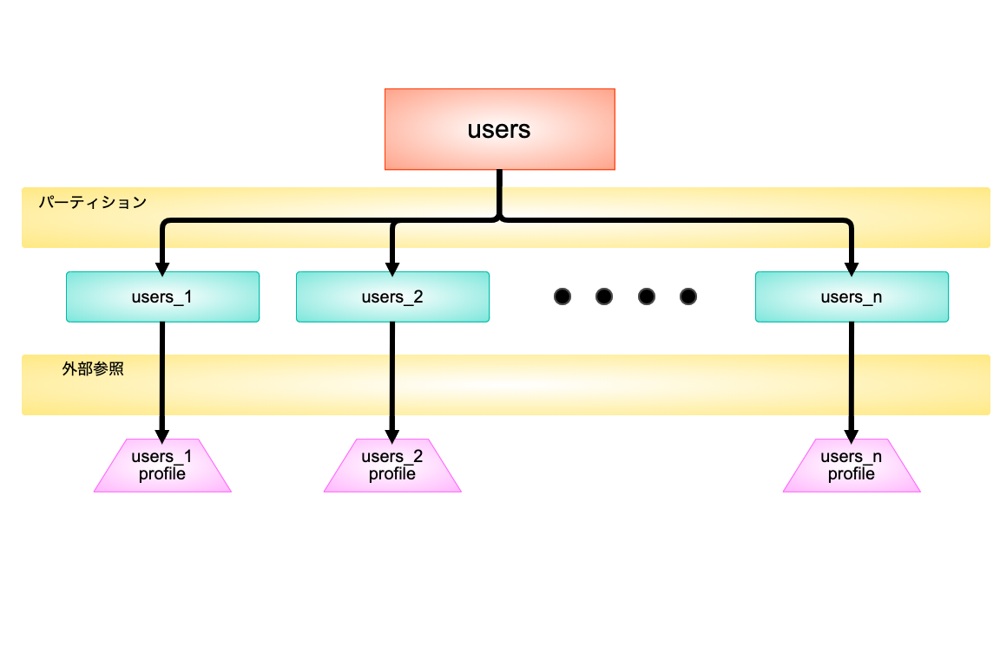
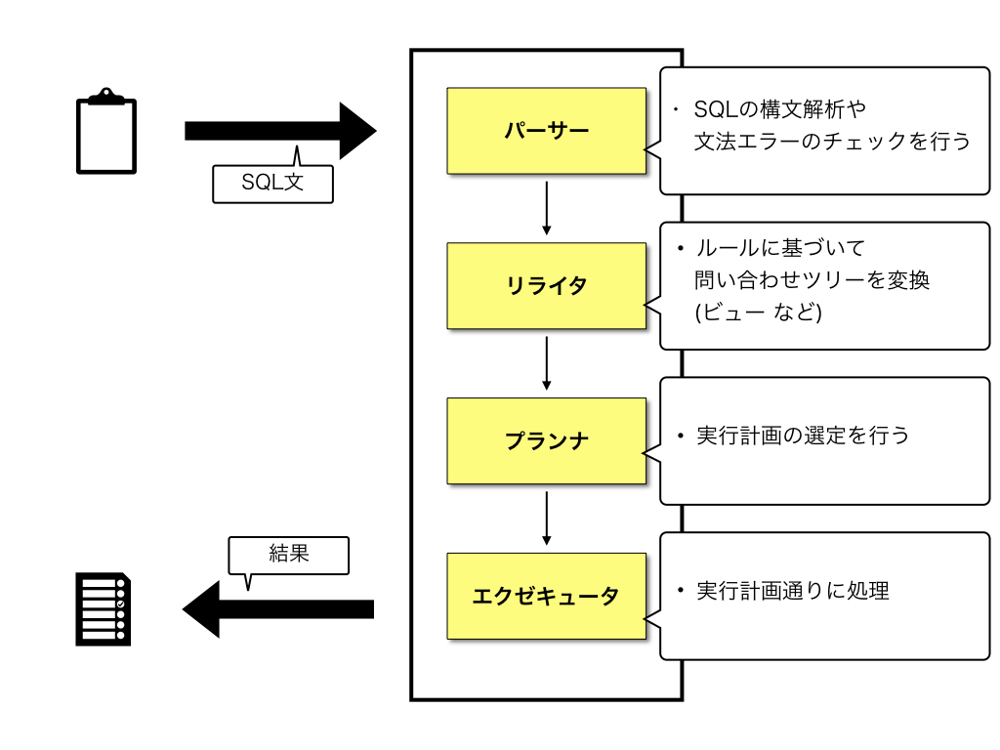
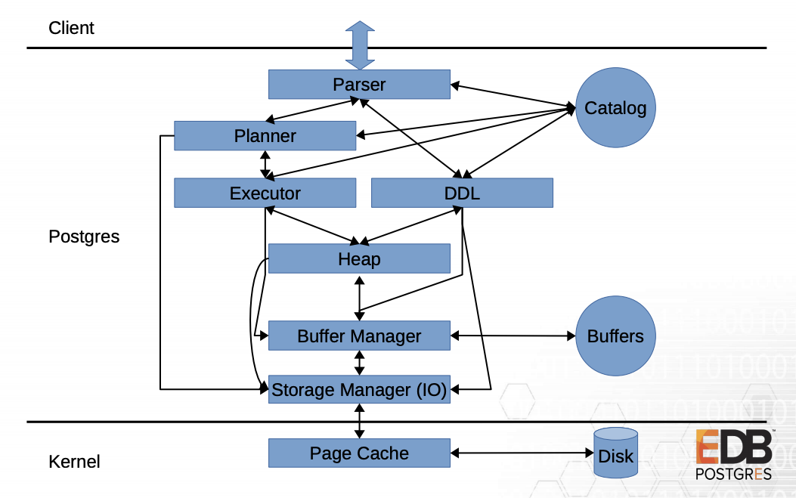
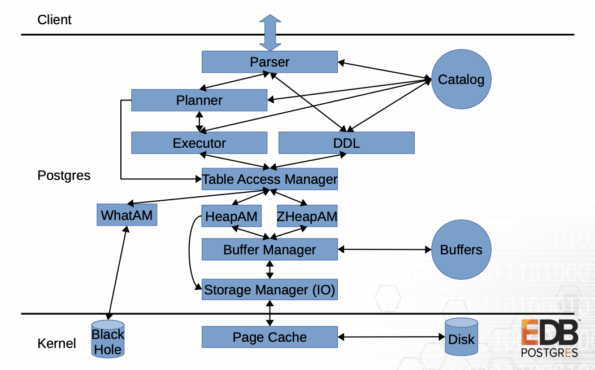

slidenumbers: true

# How do you like PostgreSQL12

## 2020-01-25 <br> 第28回 中国地方DB勉強会 in 岡山

#### 日本PostgreSQLユーザー会 中国地方支部長 <br> 高橋　一騎

---

# 注意事項

- スライドは公開しています。
- 質問とかあれば、セッション中に遠慮なく聞いてください！
- 聞くのはちょっと・・って人がいれば #ChugokuDB へお願い致します！

---

# おしながき

1. 自己紹介
2. PostgreSQLとは
3. PostgreSQL12の新機能
4. PostgreSQL13に期待される機能

---

# 1. 自己紹介

- 高橋　一騎
- 岡山在住
- 株式会社オミカレ
Webアプリケーションエンジニア
- 日本PostgreSQLユーザー会
中国支部長


---

# 株式会社オミカレ

- 全国の婚活パーティー
約30,000件を掲載してる
ポータルサイト.
- 出会いが0をZeroにする
をVisionに日々活動してます
- エンジニア（インフラの人）を
募集してます！


---

# 2. PostgreSQLとは

---

# 2. PostgreSQLとは

- `PostgreSQL（ぽすとぐれすきゅーえる）`

代表的なオープンソースのRDBMSの1つ
元々、大学の研究用に開発された研究用のRDBMSの
Ingresが元となっている。
研究用に利用されていた事もあり、
理論に忠実に開発されている。

---

# 2. PostgreSQLとは

- SQL標準に準拠した構文のサポート
- 複数種類のIndex種別のサポート
- 豊富なデータ型のサポート

---

## SQL標準に準拠した構文のサポート

- SQL標準
メーカーやシステムによって仕様が大きく異なってた。
標準化を求める声が多く集まった。
- ISO/IEC 9075 として国際標準化された。
- Check制約とかWindow関数とか。
（8.0までMySQLにはなかったんや・・）

---

## 複数種類のIndex種別のサポート

- B-Tree Index
- Hash Index
- GiST Index, SP-GiST Index , GIN Index (全文検索)
- BRIN Index

---

## 豊富なデータ型のサポート

- 列列挙（Enum）
- 幾何データ型
  - 座標点、直線、円
- IPアドレス型 (IPv4, IPv6)
  - 192.168.10.5, 192.168.11.1 どっちが大きいか比較出来る.
- JSON型 / 配列型 / 範囲型

---

# バージョンアップ履歴

- 約1年サイクルでメジャーバージョンアップが行われている。
- 9.6 までは x.y.z というバージョン形式だった
  - x.y : メジャーバージョン
  - z   : マイナーバージョン
- 10より x.z というバージョン形式になった。
  - x : メジャーバージョン
  - z : マイナーバージョン

---

# [fit]という所で・・・ <br>PostgreSQL12 今日のお話です！！！

---

# 3. PostgreSQL12の新機能

---

# 3. PostgreSQL12の新機能

- 生成列のサポート
- JSON PATH のサポート
- pg_dumpの強化
- パーティション・テーブルの強化
- Access Method

---

# 生成列(GENERATED列)のサポート

---

# 生成列のサポート

- 生成列は、テーブルに対して計算結果を元にした列を定義する.

```sql
CREATE TABLE member
(
 id SERIAL NOT NULL CONSTRAINT member_pkey PRIMARY KEY,
 first_name VARCHAR(50) NOT NULL,
 last_name VARCHAR(50) NOT NULL,
 full_name VARCHAR(50) NOT NULL GENERATED ALWAYS AS ( first_name || ' ' || last_name) STORED
);
```

- `full_name`は `first_name` と `空白` と `last_name` を
文字列結合したものになる。

---

# 生成列

実際に動かしてみるとこんな感じ

```sql
chugokudb=# INSERT INTO member (first_name, last_name) VALUES ('高橋', '一騎');
INSERT 0 1
chugokudb=#
chugokudb=# SELECT * FROM member;
 id | first_name | last_name | full_name 
----+------------+-----------+-----------
  1 | 高橋       | 一騎      | 高橋 一騎
(1 row)

```

---

# 生成列

- Insertは不可.

```sql
chugokudb=# INSERT INTO member (first_name, last_name, full_name) 
chugokudb-# VALUES ('高橋', '一騎', '高橋 一騎');
ERROR:  cannot insert into column "full_name"
DETAIL:  Column "full_name" is a generated column.
```

- DB2 => 値を渡せばその値、
 渡さなかったら生成列 みたいな奴もある.

---

# [fit] 「お、やった！ これで誕生日から年齢を常に計算出来るやん！」

---
[.autoscale: true]

# 生成列

**生成列の制約**

- 不変な値を返す関数しか使えない
- その他の生成列の値を参照する事は出来ない
- 生成列はパーティションキーに指定する事は出来ない
- など

... age(timestamp) はimmutableな関数じゃない.
（そもそも、INSERT時に値を生成して実体としてデータを保持する仕組み.）

---

## つまり、ずっと ハタチ

---

[.autoscale: true]
# 生成列

- 書き換わるタイミングは INSERT/UPDATE の時。
- ちなみに豆知識として...
SELECTの度に計算してくれる仕組みも他のRDBMSにある
  - `仮想列` と呼ばれる
  - `GENERATED ALWAYS AS ( ) STORED` を
   `GENERATED ALWAYS AS ( ) VIRTUAL` と書けば仮想列（他RDBMSの場合）
  - 構文も似てるのでいつかは実装されそう（願望

---

# 生成列のサポート

**何が嬉しいか**
- データとしては 苗字、名前 は分けて持ちたいけど
 参照としては 苗字+名前で使いたい。
- MySQLで 疑似Check制約として使うTipsがあった。

```sql
CREATE TABLE users
(
 id SERIAL NOT NULL CONSTRAINT users_pkey PRIMARY KEY,
 gender integer NOT NULL,
 gender_text NOT NULL VARCHAR(2) GENERATED ALWAYS AS
  (CASE WHEN (gender = 0) then '男性' WHEN (gender = 1) then '女性' ELSE NULL END) STORED
);
```

---

# JSON PATH のサポート

---

# JSON PATH のサポート

PostgreSQLでは2012年のv9.2からJSON型をサポート
各バージョン毎にJSON型へのサポートを強化していった

- 今回はSQL2016標準で提唱された
SQL/JSONに関する一部の関数を提供
- 検索をより楽に.

---

# PostgreSQLとJSONの歩み

- PostgreSQLではv9.2（2012年）からJSON型をサポート
- v9.4（2014年）ではJSONB型をサポート 
GINインデックスもサポート開始
- v9.3、v9.5...v11では関数や演算子の強化
例えば JSON型をパースしてレコードに変換する関数とか

^ MySQLでは 2015年 5.7.8 から

---

# JSON型とJSONB型の違い

| | JSON型 | JSONB型 |
| --- | --- | --- |
| 格納方式 | テキスト | バイナリ（不要な空白や重複keyを削除など）| 
| インデックス | Btree | Btree, GINインデックス | 
| 検索性能 | 一般的に低速、評価の度に内部でパーサーが動く | GINにより効率的に検索可能 | 

---

- JSON型とJSONB型の違い

**JSON型**

```sql
CREATE TABLE member
(
 id SERIAL NOT NULL CONSTRAINT member_pkey PRIMARY KEY,
 profile JSON NOT NULL
);
```

**JSONB型**

```sql
CREATE TABLE member
(
 id SERIAL NOT NULL CONSTRAINT member_pkey PRIMARY KEY,
 profile JSONB NOT NULL
);
```

---

- JSON型とJSONB型の違い (INSERT/SELECT *)

```sql
INSERT INTO member (profile) VALUES ('{"name": "高橋", "gender": "男性", "age":"29"}');
```

**JSON型**

```
 id |                    profile                     
----+------------------------------------------------
  1 | {"name": "高橋", "gender": "男性", "age":"29"}
(1 row)
```

**JSONB型**

```
 id |                     profile                     
----+-------------------------------------------------
  1 | {"age": "29", "name": "高橋", "gender": "男性"}
(1 row)
```

---

[.autoscale: true]
- JSON型とJSONB型の違い (WHERE)

```sql
EXPLAIN ANALYZE SELECT * FROM member WHERE profile->>'name' = '高橋';
```

**JSON型**

**JSONB型**

- どちらも同じレコードが返る.


---

[.autoscale: true]
- JSON型とJSONB型の違い (WHERE)

**JSON型**

```sql
SELECT * FROM member WHERE profile = '{"name": "高橋", "gender": "男性", "age":"29"}'::json;

ERROR:  operator does not exist: json = json
```

**JSONB型**

```sql
SELECT * FROM member WHERE profile = '{"name": "高橋", "gender": "男性", "age":"29"}'::jsonb;

 id |                     profile                     
----+-------------------------------------------------
  1 | {"age": "29", "name": "高橋", "gender": "男性"}
```

等価比較だけじゃなくて `含む` とかも検索出来る

---

- JSONB型演算子

```sql
# 結合
・ SELECT profile || '{"birthday":"1990-12-11"}'::jsonb FROM member;
  # {"age": "29", "name": "高橋", "gender": "男性", "birthday": "1990-12-11"}

# 削除
・ SELECT profile - 'name'::jsonb FROM member;
  # {"age": "29", "gender": "男性"}

# keyチェック OR
・ SELECT id, profile ?| array['name','birthday'] FROM member_b;
  # true

# keyチェック AND
・ SELECT profile ?| array['name','birthday'] FROM member;
  # false
```

---

### JSON型とJSONB型の違い

JSON型とJSONB型、JSONB型の方が良い。
- 関数のサポートが豊富
（更新や展開が楽）
- インデックスによる検索にも対応しており高速

---

# JSON PATHのサポート

- JSONB型への機能の追加
- 値の取り出しを楽にする機構

---

# JSON PATHの例

| JSON PATH | 説明 |
| --- | --- |
|`$.store.book[*].title` | bookの中のtitleを取得 |
|`$..price` | 全エレメントの中からpriceを再帰的に取得 |
|`$..book[2]` | bookを再帰的に取得した後bookの配列の3番目を取得 |
|`$..book.length()` | bookを再帰的に取得した後bookの配列の要素数を取得 |


---

# JSON PATH の例

- `jsonb_path_query`: `指定されたJSONB値のJSONPATHによって返されたすべてのJSON項目を取得`

- `jsonb_path_exists`: `JSONPATHが指定されたJSONB値の項目を返すかどうかを確認する`

```sql
CREATE TABLE books
(
 id SERIAL NOT NULL CONSTRAINT books_pkey PRIMARY KEY,
 data JSONB NOT NULL
);
```

---

# デモ

^ INSERT INTO books(data) VALUES ('{"store":{"book":[{"category":"reference","author":"Nigel Rees","title":"Sayings of the Century","price":8.95},{"category":"fiction","author":"Evelyn Waugh","title":"Sword of Honour","price":12.99},{"category":"fiction","author":"Herman Melville","title":"Moby Dick","isbn":"0-553-21311-3","price":8.99},{"category":"fiction","author":"J. R. R. Tolkien","title":"The Lord of the Rings","isbn":"0-395-19395-8","price":22.99}],"bicycle":{"color":"red","price":19.95}},"expensive":10}')

---

# JSON PATHのサポート

- JSON PATH によって再帰的に検索が行われるので楽.
- 曽根先生の名著『失敗から学ぶRDBの正しい歩き方』にもあるように【JSONの甘い罠】に注意.
（こうやってちやほやするのも後一週間ですね☆）
- ORM...

---

# pg_dumpの強化

---

# pg_dumpの強化

（ここらで少し楽なもの）

pg_dump に以下のオプションが追加

- `--rows-per-insert`
- `--on-conflict-do-nothing`

上記はどちらも `--inserts` オプションと同様に使用する

---

# pg_dumpの強化

```sql
CREATE TABLE option_user
(
 id SERIAL NOT NULL PRIMARY KEY,
 name VARCHAR(50) NOT NULL
);
```

---

[.autoscale: true]

# pg_dumpの強化

- `pg_dump -U docker -t option_user chugokudb --inserts`

```sql
INSERT INTO public.option_user VALUES (1, 'Berte Kliement');
INSERT INTO public.option_user VALUES (2, 'Lula Da Costa');
INSERT INTO public.option_user VALUES (3, 'Rodi Rapport');
INSERT INTO public.option_user VALUES (4, 'Iris Runacres');
INSERT INTO public.option_user VALUES (5, 'Peirce MacPike');
INSERT INTO public.option_user VALUES (6, 'Pat Haresnaip');
INSERT INTO public.option_user VALUES (7, 'Fiann Gascard');
INSERT INTO public.option_user VALUES (8, 'Pauly Cantera');
INSERT INTO public.option_user VALUES (9, 'Leo Drewes');
INSERT INTO public.option_user VALUES (10, 'Joane Clague');
INSERT INTO public.option_user VALUES (11, 'Annabelle Stollberger');
INSERT INTO public.option_user VALUES (12, 'Nichole Andreaccio');
INSERT INTO public.option_user VALUES (13, 'Cahra Gabites');
INSERT INTO public.option_user VALUES (14, 'Zola Laudham');
INSERT INTO public.option_user VALUES (15, 'Tanitansy Lacrouts');
```

---

[.autoscale: true]

# pg_dumpの強化

- `pg_dump -U docker -t option_user chugokudb --inserts --on-conflict-do-nothing`

```sql
INSERT INTO public.option_user VALUES (1, 'Berte Kliement') ON CONFLICT DO NOTHING;
INSERT INTO public.option_user VALUES (2, 'Lula Da Costa') ON CONFLICT DO NOTHING;
INSERT INTO public.option_user VALUES (3, 'Rodi Rapport') ON CONFLICT DO NOTHING;
INSERT INTO public.option_user VALUES (4, 'Iris Runacres') ON CONFLICT DO NOTHING;
INSERT INTO public.option_user VALUES (5, 'Peirce MacPike') ON CONFLICT DO NOTHING;
INSERT INTO public.option_user VALUES (6, 'Pat Haresnaip') ON CONFLICT DO NOTHING;
INSERT INTO public.option_user VALUES (7, 'Fiann Gascard') ON CONFLICT DO NOTHING;
INSERT INTO public.option_user VALUES (8, 'Pauly Cantera') ON CONFLICT DO NOTHING;
INSERT INTO public.option_user VALUES (9, 'Leo Drewes') ON CONFLICT DO NOTHING;
INSERT INTO public.option_user VALUES (10, 'Joane Clague') ON CONFLICT DO NOTHING;
INSERT INTO public.option_user VALUES (11, 'Annabelle Stollberger') ON CONFLICT DO NOTHING;
INSERT INTO public.option_user VALUES (12, 'Nichole Andreaccio') ON CONFLICT DO NOTHING;
INSERT INTO public.option_user VALUES (13, 'Cahra Gabites') ON CONFLICT DO NOTHING;
INSERT INTO public.option_user VALUES (14, 'Zola Laudham') ON CONFLICT DO NOTHING;
INSERT INTO public.option_user VALUES (15, 'Tanitansy Lacrouts') ON CONFLICT DO NOTHING;
```

---

[.autoscale: true]

# pg_dumpの強化

- `pg_dump -U docker -t option_user chugokudb --inserts --rows-per-insert=5`

```sql
INSERT INTO public.option_user VALUES
	(1, 'Berte Kliement'),
	(2, 'Lula Da Costa'),
	(3, 'Rodi Rapport'),
	(4, 'Iris Runacres'),
	(5, 'Peirce MacPike');
INSERT INTO public.option_user VALUES
	(6, 'Pat Haresnaip'),
	(7, 'Fiann Gascard'),
	(8, 'Pauly Cantera'),
	(9, 'Leo Drewes'),
	(10, 'Joane Clague');
INSERT INTO public.option_user VALUES
	(11, 'Annabelle Stollberger'),
	(12, 'Nichole Andreaccio'),
	(13, 'Cahra Gabites'),
	(14, 'Zola Laudham'),
	(15, 'Tanitansy Lacrouts');
```

--- 

[.autoscale: true]

# pg_dumpの強化

- バックアップの時に BulkInsertに対応出来るようになった.
  - 当然、通常のInsertよりBulkInsertの方が速い。
  - 使いどきがあまり浮かんでない。。
- 毎日常にバックアップをテストサーバーに復元するみたいなユースケースで
Insert文を加工してデータマスクする、みたいなそういう感じ？
  - 速度がボトルネックとか思ってたらこれを使用すると多少色々できる。
  - 後、`ON CONFLICT DO NOTHING` をつけることで予めデータを絞らなくても良いみたな乱暴な事もできないこともない。
  ※ 今回のバージョンアップで COPY文にWHERE句つける事ができるように・・

--- 

# パーティション・テーブルの強化

---
[.autoscale: true]

# パーティション・テーブルの強化

- パーティション・キーのFOR VALUES句で固定値だけでなく
計算した値も指定可能に
- 外部キーの参照先としてパーティション・テーブルを指定可能に
- 関数でパーティション・テーブルのツリー構造を表示可能に

---

[.autoscale: true]
# パーティション・テーブルの歩み

**PostgreSQL10**

- ネイティブ・パーティショニングがサポート開始

**PostgreSQL11**

- 親テーブルにインデックスを設定すると子テーブルにも生成される
- どの条件にも合致しないデータを
保存するデフォルトパーティションをサポート
- ハッシュパーティションをサポート

---

# パーティション・テーブルの歩み

PostgreSQL9.6まで。。。
超頑張って パーティショニングを実現していた。

---

# PostgreSQL9.6までのパーティショニング

- 親テーブルを定義

```sql
CREATE TABLE japan_cities (
  pref VARCHAR(10),
  city VARCHAR(25),
  UNIQUE(pref, city)
);
```

- 子テーブルを定義

```sql
CREATE TABLE okayama_cities (CHECK (pref IN ('岡山'))) INHERITS (japan_cities);
CREATE TABLE hiroshima_cities (CHECK (pref IN ('広島'))) INHERITS (japan_cities);
```

---

[.autoscale: true]

# PostgreSQL9.6までのパーティショニング

- トリガーを定義

```sql
CREATE OR REPLACE FUNCTION pref_partion() RETURNS TRIGGER AS $$
BEGIN

IF ( NEW.pref = '岡山') THEN
  INSERT INTO okayama_cities VALUES (NEW.*);
ELSIF ( NEW.pref = '広島') THEN
  INSERT INTO hiroshima_cities VALUES (NEW.*);
ELSE
  RAISE EXCEPTION 'ERROR';
END IF;

RETURN NULL;
END;
$$
LANGUAGE plpgsql;
```

---

[.autoscale: true]

# PostgreSQL9.6までのパーティショニング

- 親テーブルに反映

```sql
CREATE TRIGGER japan_pref_insert_trigger
BEFORE INSERT ON japan_cities 
FOR EACH ROW EXECUTE PROCEDURE pref_partion();
```

---

# PostgreSQL9.6までのパーティショニング

**従来の方法のデメリット**

- トリガー定義面倒臭い
- 子テーブルが増えるとトリガーのアップデートが必要
- 遅い
- ORMと相性が悪い

---

# ネイティブ・パーティショニング

```sql
CREATE TABLE japan_cities (
  pref VARCHAR(10),
  city VARCHAR(25),
  UNIQUE(pref, city)
) PARTITION BY LIST (pref);

CREATE TABLE okayama_cities PARTITION OF japan_cities
FOR VALUES IN ('岡山');

CREATE TABLE hiroshima_cities PARTITION OF japan_cities
FOR VALUES IN ('広島');
```

---

# ネイティブ・パーティショニング

**メリット**

- トリガーのメンテナンスが不要
- 子テーブルの追加もDDL文で完結する
- 振り分けのルールに重複があったらエラーになる
- 速い（従来の10倍とか)

---

# ネイティブ・パーティショニングが速い理由

- パーティション・プルーニング

```sql
SELECT * FROM japan_cities WHERE pref = '岡山';
```
実行計画は子テーブルの パーティションキーの条件を確認して
`okayama_cities` テーブルを対象に検索する
=> 無駄の無い検索が可能になった
ORMはあくまで `japan_cities` に対してクエリを投げ
DB側の責務で分散みたいな事も可能

---

# [fit]PostgreSQL12でのパーティション・テーブルの新機能

- パーティション・キーのFOR VALUES句で固定値だけでなく
計算した値も指定可能に
- 外部キーの参照先としてパーティション・テーブルを指定可能に
- 関数でパーティション・テーブルのツリー構造を表示可能に

---

# パーティション・テーブルの強化

- パーティション・キーのFOR VALUES句で固定値だけでなく
計算した値も指定可能に

```sql
CREATE TABLE sale (
    id integer not null, sale_data date not null
) PARTITION BY RANGE (sale_data);

CREATE TABLE sale_1 PARTITION OF sale
FOR VALUES FROM (CURRENT_DATE::timestamp) TO (CURRENT_DATE::timestamp + '1 year');

CREATE TABLE sale_2 PARTITION OF sale
FOR VALUES FROM (CURRENT_DATE::timestamp  + '1 year') TO (CURRENT_DATE::timestamp + '2 year');
```

※ これまでは syntax error だった。

---

# パーティション・テーブルの強化

```sql
CREATE TABLE sale_1 PARTITION OF sale
FOR VALUES FROM (CURRENT_DATE::timestamp) TO (CURRENT_DATE::timestamp + '1 year');
```

`CURRENT_DATE::timestamp` だと都度パーティションキーが変わるのでは 🤔？

---

# パーティション・テーブルの強化

`FOR VALUES` に指定した関数などの値は CREATE TABLE時に一度だけ評価され、テーブル定義に実行結果が保存される。

```
\d+ test_sale
                            Partitioned table "public.test_sale"
  Column   |  Type   | Collation | Nullable | Default | Storage | Stats target | Description 
-----------+---------+-----------+----------+---------+---------+--------------+-------------
 id        | integer |           | not null |         | plain   |              | 
 sale_data | date    |           | not null |         | plain   |              | 
Partition key: RANGE (sale_data)
Partitions: test_sale_1 FOR VALUES FROM ('2020-01-19') TO ('2021-01-19'),
            test_sale_2 FOR VALUES FROM ('2021-01-19') TO ('2022-01-19')
```

---

# パーティション・テーブルの強化

- 外部キーの参照先としてパーティション・テーブルを指定可に

```sql
CREATE TABLE users (
    id integer not null primary key
) PARTITION BY RANGE (id);

CREATE TABLE users_1 PARTITION OF users FOR VALUES FROM (1) TO (100000);

CREATE TABLE users_2 PARTITION OF users FOR VALUES FROM (100001) TO (200000);

CREATE TABLE user1_profile (
  id BIGSERIAL PRIMARY KEY,
  user_id INTEGER references users_1 (id)
    deferrable initially deferred,
  name VARCHAR(25) NOT NULL
);
```

---

# パーティション・テーブルの強化

```
# SELECT * FROM users;
   id   
--------
     50
 190100

# INSERT INTO user1_profile (user_id, name) VALUES (50, 'ユーザー50');
INSERT 0 1

# INSERT INTO user1_profile (user_id, name) VALUES (190100, 'ユーザー190100');

ERROR:  insert or update on table "user1_profile" 
violates foreign key constraint "user1_profile_user_id_fkey"

```

---

# パーティション・テーブルの強化

- これも使い所はよく考えてやる必要がある
- 某氏の著書 **第９章 強すぎる制約** （まだ上司だからね）にもあるように 多用すると パーティション・テーブルの良い所を○してしまう。

---

# パーティション・テーブルの強化



---

# パーティション・テーブルの強化

- `¥dP` で パーティション・テーブルがリスト化

```
# \dP
                          List of partitioned relations
 Schema |            Name            | Owner  |       Type        |    Table     
--------+----------------------------+--------+-------------------+--------------
 public | japan_cities               | docker | partitioned table | 
 public | test_sale                  | docker | partitioned table | 
 public | users                      | docker | partitioned table | 
 public | japan_cities_pref_city_key | docker | partitioned index | japan_cities
 public | users_pkey                 | docker | partitioned index | users
```

---


# パーティション・テーブルの強化

- `pg_partition_tree` で パーティション・テーブルの階層を可視化

```
# SELECT * FROM pg_partition_tree('japan_cities');

      relid       | parentrelid  | isleaf | level 
------------------+--------------+--------+-------
 japan_cities     |              | f      |     0
 okayama_cities   | japan_cities | t      |     1
 hiroshima_cities | japan_cities | t      |     1

```

---

# Access Method

---

[.autoscale: true]

# Access Method

これは今後の進化の為の布石..!

- `Pluggable Table Storage Interface` 
- 独自のストレージエンジン（Access Method) を定義できるようになった
  - 現在はデフォルト（従来）のHeapのみ
  - MySQL でいうMyISAMとInnoDBみたいなもの
- Vacuumがいらないストレージエンジンとか.
  - PG13以降で実装予定との事らしい

---

# Access Method

テーブルに対してストレージエンジンを指定できるようになった。

```sql
CREATE TABLE test_table (
  id integer,
  name varchar(25)
) USING heap;
```

同様に `Materialized View` でも指定できる

```sql
CREATE MATERIALIZED VIEW test_view USING heap AS SELECT * FROM test_table;
```

---

# Access Method



---

# Access Method



---

# Access Method



--- 

[.autoscale: true]

# 参考文献

- [https://github.com/json-path/JsonPath](https://github.com/json-path/JsonPath)
- [https://www.postgresql.jp/document/11/html/app-pgdump.html](https://www.postgresql.jp/document/11/html/app-pgdump.html)
- [https://qiita.com/nuko_yokohama/items/82b9960dba3dee830b09](https://qiita.com/nuko_yokohama/items/82b9960dba3dee830b09)
- [https://h50146.www5.hpe.com/products/software/oe/linux/mainstream/support/lcc/pdf/PostgreSQL_12_GA_New_Features_ja_20191011-1.pdf](https://h50146.www5.hpe.com/products/software/oe/linux/mainstream/support/lcc/pdf/PostgreSQL_12_GA_New_Features_ja_20191011-1.pdf)
- [https://www.sraoss.co.jp/tech-blog/wp-content/uploads/2019/10/pg12_report_1004.pdf](https://www.sraoss.co.jp/tech-blog/wp-content/uploads/2019/10/pg12_report_1004.pdf)
- [https://anarazel.de/talks/2019-05-30-pgcon-pluggable-table-storage/pluggable.pdf](https://anarazel.de/talks/2019-05-30-pgcon-pluggable-table-storage/pluggable.pdf)

---
